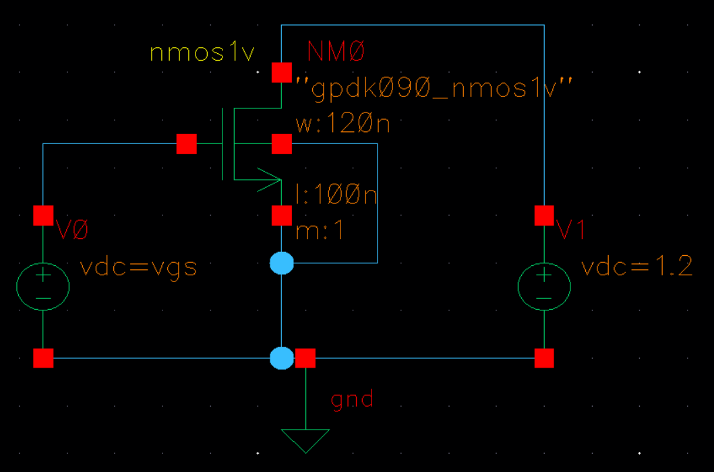
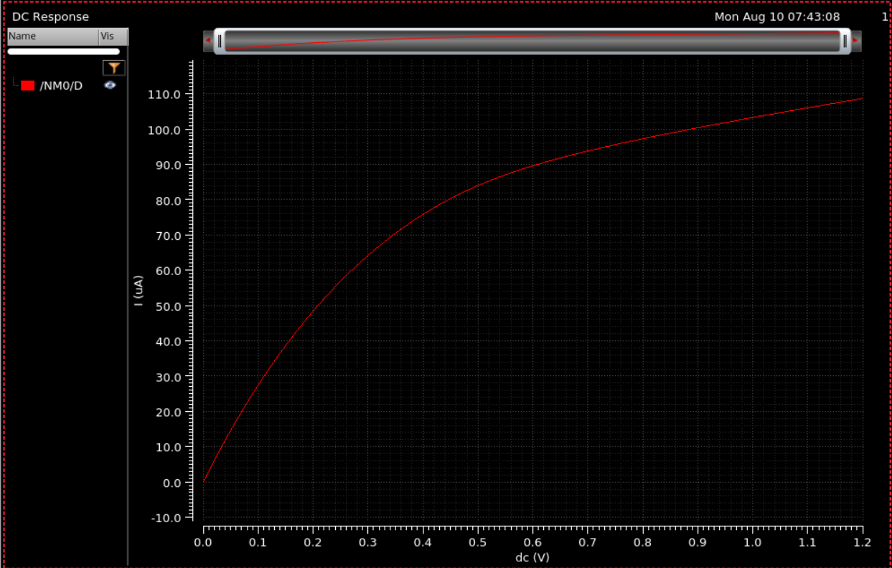
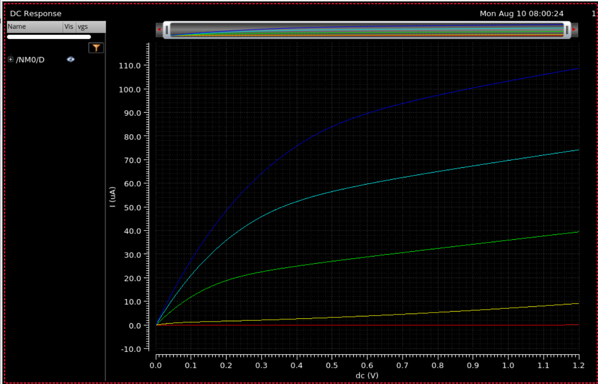
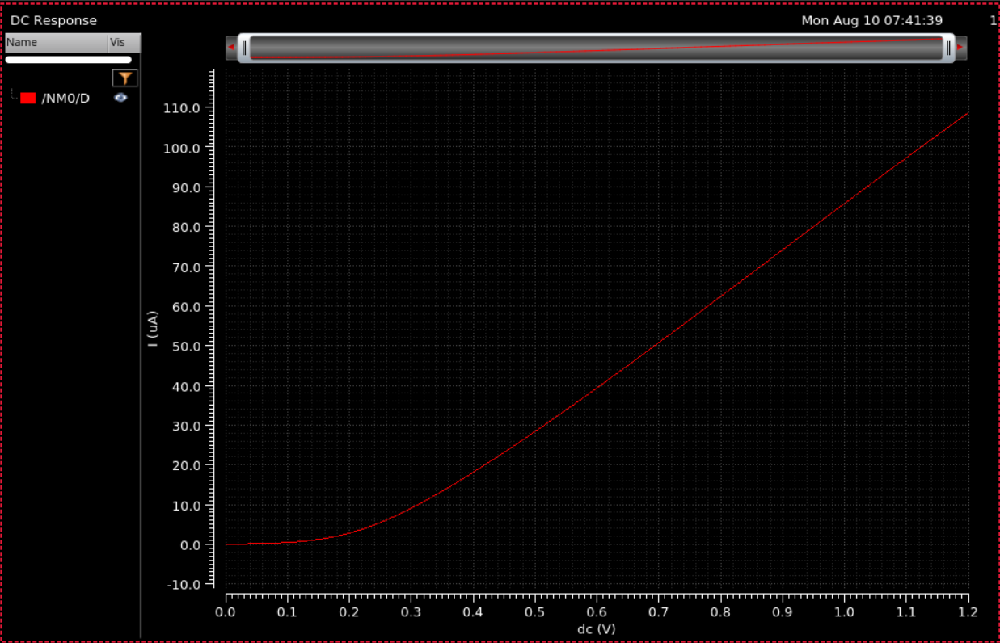

# Experiment 1: NMOS Characterization

## Aim

To obtain and plot the drain characteristics and transfer characteristics of an NMOS transistor using circuit simulation software (Cadence Virtuoso).

## Design Specifications

| Parameter | Value |
|---|---|
| Device | `nmos1v` (gpdk090_nmos1v) |
| Width (W) | 120 nm |
| Length (L) | 100 nm |
| Multiplier (m) | 1 |
| Supply voltage (VDD) | 1.2 V |
| VGS sweep range | 0 – 1.2 V |
| VDS sweep range | 0 – 1.2 V |
| Technology | GPDK090 |

## Circuit Description

The NMOS test schematic consists of a single `nmos1v` device with two independent DC voltage sources:
- **V0**, connected to the gate, sets `VGS`.
- **V1**, connected to the drain, sets `VDS`.

The source and bulk terminals are tied to ground. This configuration allows both the gate-source and drain-source voltages to be swept independently to characterize the device.

See [`schematic/nmos_test_schematic.png`](./schematic/nmos_test_schematic.png) for the circuit.

## Simulation Procedure

1. **Schematic capture** — Drew the NMOS test schematic in Virtuoso with independent `VGS` and `VDS` bias sources connected to the gate and drain terminals respectively.
2. **Drain characteristics (ID vs VDS)** — Set up a DC sweep of `V1` (drain supply) from 0 to 1.2 V at a fixed `VGS`, and plotted the resulting drain current.
   - [`simulation/drain_chara/dc_analysis_setup_V1_vds_sweep.png`](./simulation/drain_chara/dc_analysis_setup_V1_vds_sweep.png) — DC analysis setup
   - [`simulation/drain_chara/adeL_drain_characteristics_run.png`](./simulation/drain_chara/adeL_drain_characteristics_run.png) — ADE-L run
3. **Family of curves** — Used **Tools → Parametric Analysis** to sweep `VGS` (0 to 1.2 V, 5 linear steps) while re-running the `V1` DC sweep, producing a family of `ID` vs `VDS` curves for different `VGS` values.
   - [`simulation/diff_vgs/parametric_analysis_start.png`](./simulation/diff_vgs/parametric_analysis_start.png) — parametric sweep start
   - [`simulation/diff_vgs/parametric_analysis_progress.png`](./simulation/diff_vgs/parametric_analysis_progress.png) — parametric sweep in progress
4. **Transfer characteristics (ID vs VGS)** — Ran a separate DC sweep with `VGS` (`V0`) as the sweep variable (0 to 1.2 V) at a fixed `VDS`, to obtain the drain current as a function of gate-source voltage.
   - [`simulation/transfer_chara/dc_analysis_setup_V0_vgs_sweep.png`](./simulation/transfer_chara/dc_analysis_setup_V0_vgs_sweep.png) — DC analysis setup
   - [`simulation/transfer_chara/adeL_transfer_characteristics_run.png`](./simulation/transfer_chara/adeL_transfer_characteristics_run.png) — ADE-L run

## Results

### Drain Characteristics (ID vs VDS)

See [`IV_characteristics/Drain_chara/drain_characteristics.png`](./IV_characteristics/Drain_chara/drain_characteristics.png) — drain current increases with VDS, saturating once VDS exceeds VDSAT for the given VGS, consistent with the device entering saturation.

### Family of ID–VDS Curves (parametric sweep over VGS)

See [`IV_characteristics/diff_vgs/family_of_curves.png`](./IV_characteristics/diff_vgs/family_of_curves.png) — higher VGS values produce proportionally higher saturation drain currents, as expected from square-law MOSFET behavior.

### Transfer Characteristics (ID vs VGS)

See [`IV_characteristics/transfer_chara/transfer_characteristics.png`](./IV_characteristics/transfer_chara/transfer_characteristics.png) — drain current is negligible below threshold voltage and increases with VGS above threshold, confirming correct turn-on behavior.

## Observations

- Drain current showed the expected square-law dependence on VGS in saturation and linear dependence on VDS in the triode region.
- The family of ID–VDS curves clearly separates by VGS, verifying correct gate control of channel current.

## Conclusion

The drain and transfer characteristics of the NMOS device (GPDK090, W = 120 nm, L = 100 nm) were successfully obtained using Cadence Virtuoso.

## Files in this folder

- [`schematic/`](./schematic) — NMOS test schematic screenshot
- [`simulation/`](./simulation) — ADE-L analysis setup and run screenshots
  - [`drain_chara/`](./simulation/drain_chara) — DC sweep setup and run for drain characteristics
  - [`transfer_chara/`](./simulation/transfer_chara) — DC sweep setup and run for transfer characteristics
  - [`diff_vgs/`](./simulation/diff_vgs) — Parametric analysis setup and progress
- [`IV_characteristics/`](./IV_characteristics) — Output waveforms, one subfolder per characteristic:
  - [`Drain_chara/`](./IV_characteristics/Drain_chara) — ID vs VDS plot
  - [`transfer_chara/`](./IV_characteristics/transfer_chara) — ID vs VGS plot
  - [`diff_vgs/`](./IV_characteristics/diff_vgs) — Parametric ID–VDS family of curves over VGS
- [`report/NMOS_Chara_Report.pdf`](./report/NMOS_Chara_Report.pdf) — Full lab report
