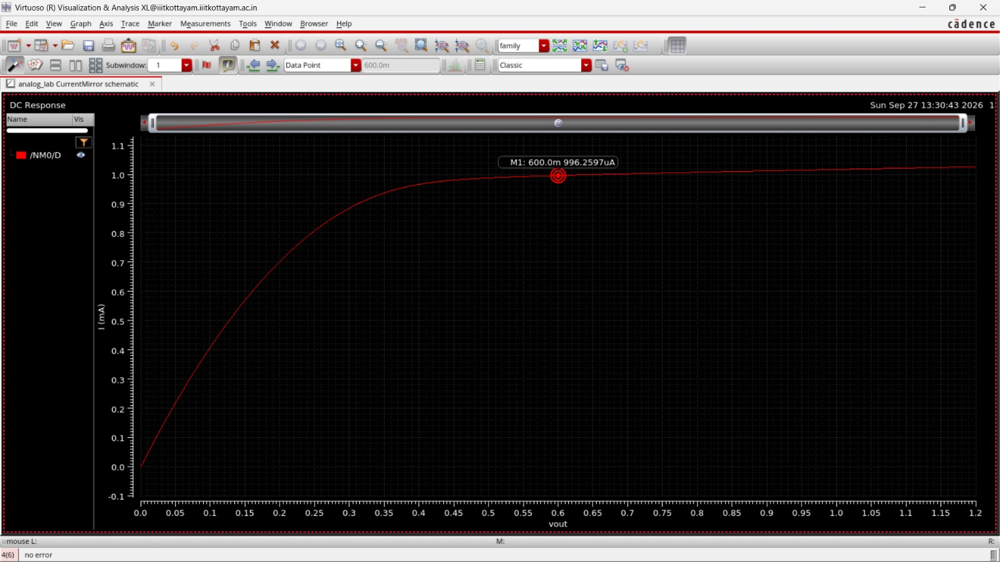
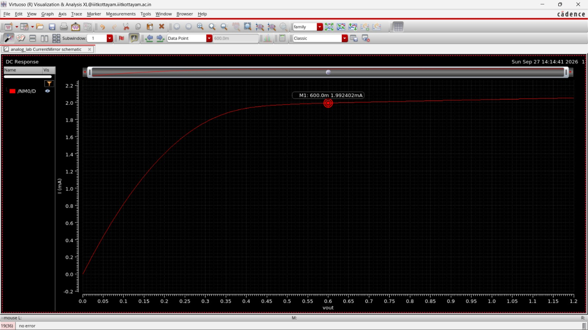
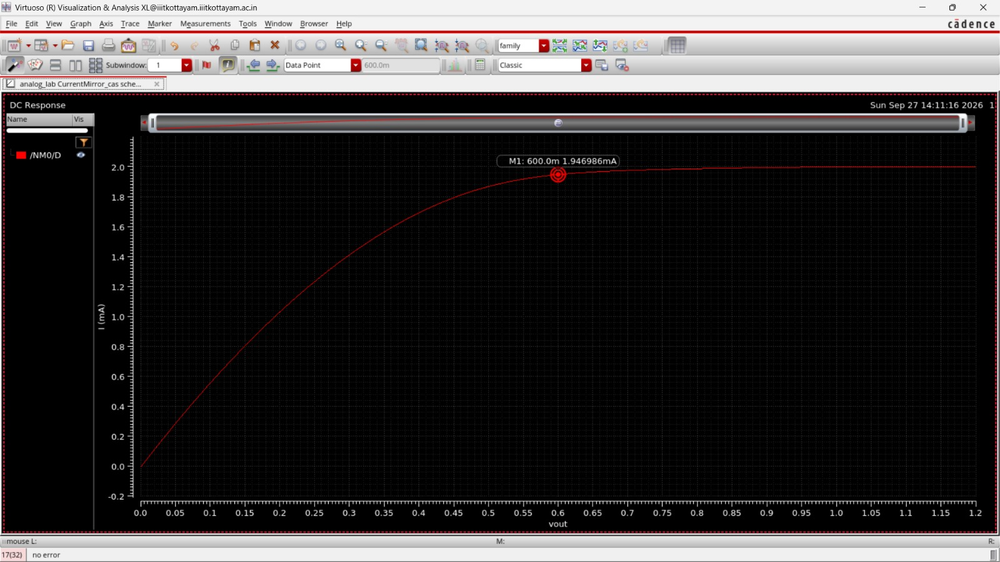

# Experiment 3: Current Mirror — Simple and Cascode

## Aim

To design and simulate a simple NMOS current mirror and a cascode NMOS current mirror in Cadence Virtuoso to obtain 1mA and 2mA currents.

## Design Specifications

| Variant | Reference width (W_ref) | Output width (W_out) | Length (L) | Reference current (I1) | Expected I_out |
|---|---|---|---|---|---|
| Simple mirror — 1:1 | 34.7 µm | 34.7 µm | 1 µm | 1 mA | ≈ 1 mA |
| Simple mirror — 2:1 | 34.7 µm | 69.4 µm | 1 µm | 1 mA | ≈ 2 mA |
| Cascode mirror — 1:1 | 34.7 µm | 34.7 µm | 1 µm | 1 mA | ≈ 1 mA |
| Cascode mirror — 2:1 | 34.7 µm | 69.4 µm | 1 µm | 1 mA | ≈ 2 mA |

Technology: GPDK090.

## Why this width

- **Reference width = 34.7 µm** calculated using gm/Id method sets the diode-connected device's operating point at the 1 mA reference current so it sits in a practical saturation overdrive 
- **Cascode devices are sized equal to the transistor directly beneath them in the same branch** (34.7 µm on 34.7 µm for the reference stack; matching widths in the output stack for each ratio). Keeping the same width — and hence the same current density / overdrive in each branch,so the cascode device does not disturb the ratio already set by the lower mirror pair; it only adds a `gm·ro` boost in series, raising the output resistance without changing the ideal mirrored current.

## Circuit Description

**Simple mirror:** two matched `nmos1v` devices. The reference-side device is diode-connected (gate tied to drain) and carries the 1 mA reference current from an ideal current source. The resulting VGS is applied to the output device, whose drain is the swept output node.

**Cascode mirror:** a second diode-connected device is stacked above each transistor of the simple mirror. The bottom reference device sets the mirror ratio exactly as in the simple case; the top reference device biases the cascode transistor stacked above the output device, raising the output resistance seen at the output node.

| Variant | Schematic |
|---|---|
| Simple — 1:1 | [`Schematic/simple_schematic1m.jpeg`](./Schematic/simple_schematic1m.jpeg) |
| Simple — 2:1 | [`Schematic/simple_schematic2m.jpeg`](./Schematic/simple_schematic2m.jpeg) |
| Cascode — 1:1 | [`Schematic/cascode_schematic1m.jpeg`](./Schematic/cascode_schematic1m.jpeg) |
| Cascode — 2:1 | [`Schematic/cascode_schematic2m.jpeg`](./Schematic/cascode_schematic2m.jpeg) |

## Results

| Variant | Marker reading (at V_out = 600 mV) | Waveform file |
|---|---|---|
| Simple — 1:1 | 996.26 µA | [`Waveforms/cascode_waveform_1m.jpeg`](./Waveforms/cascode_waveform_1m.jpeg) |
| Simple — 2:1 | 1.992 mA | [`Waveforms/cascode_waveform2m.jpeg`](./Waveforms/cascode_waveform2m.jpeg) |
| Cascode — 1:1 | 973.84 µA | [`Waveforms/simple_waveform1m.jpeg`](./Waveforms/simple_waveform1m.jpeg) |
| Cascode — 2:1 | 1.947 mA | [`Waveforms/simple_waveform2m.jpeg`](./Waveforms/simple_waveform2m.jpeg) |

## Observations

- Both topologies reproduce their target reference-scaled current (≈1 mA at 1:1, ≈2 mA at 2:1) once the output device enters saturation, confirming `I_out/I_ref = W_out/W_ref` holds for both the simple and cascode mirrors.
- The simple mirror's output current keeps rising gradually across the swept output voltage, indicating a comparatively low output resistance.
- The cascode mirror's output current flattens out and stays essentially flat for the rest of the sweep, confirming its higher output resistance relative to the simple mirror at the same width ratio.
- The cascode mirror needs a higher output (compliance) voltage before the current settles, compared to the simple mirror — the expected trade-off for the extra output resistance.

## Conclusion

Simple and cascode current mirrors were designed and simulated in Cadence Virtuoso at two width ratios (1:1 and 2:1). Both topologies accurately reproduced the current scaling set by the transistor width ratio, and the cascode configuration showed a flatter output characteristic and higher output resistance.

## Files in this folder

- [`Schematic/`](./Schematic) — simple and cascode mirror schematics, at 1:1 and 2:1 width ratios
- [`Waveforms/`](./Waveforms) — output I–V characteristic screenshots for all four schematics
- [`report/`](./CurrentMirror_Design_Report.pdf) — full lab report 
