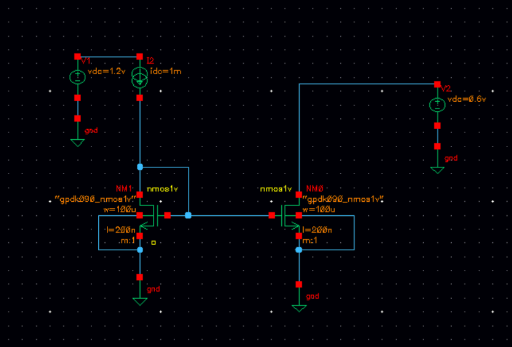
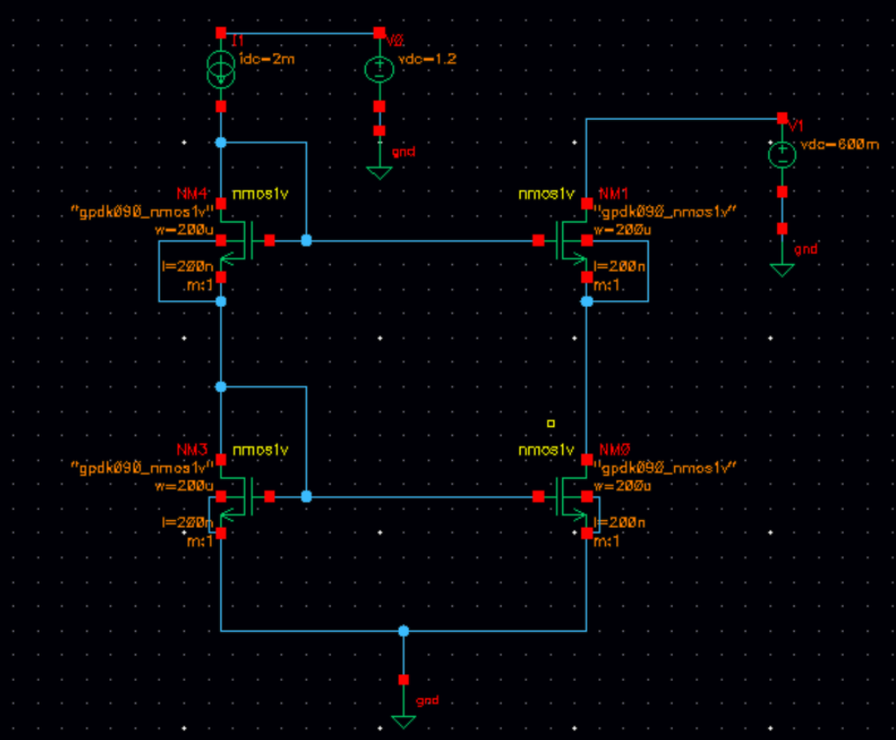
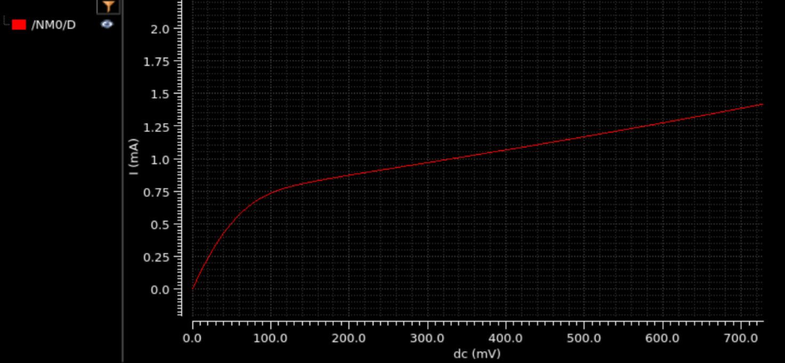
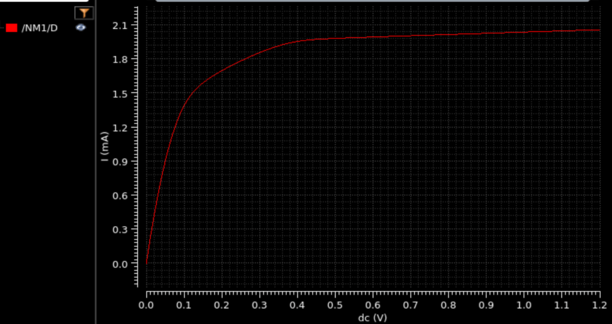

# Experiment 3: Current Mirror

## Aim

To design, simulate, and compare a simple (two-transistor) NMOS current mirror and a cascode NMOS current mirror using Cadence Virtuoso, and to study the improvement in output resistance provided by cascoding.

## Design Specifications

### Simple Current Mirror

| Parameter | Value |
|---|---|
| Device | `nmos1v` (gpdk090_nmos1v) |
| Width (W) | 100 µm |
| Length (L) | 200 nm |
| Reference current (I2) | 1 mA |
| Reference branch supply (V1) | 1.2 V |
| Technology | GPDK090 |

### Cascode Current Mirror

| Parameter | Value |
|---|---|
| Device | `nmos1v` (gpdk090_nmos1v) |
| Width (W) | 200 µm |
| Length (L) | 200 nm |
| Reference current (I1) | 2 mA |
| Reference branch supply (V0) | 1.2 V |
| Technology | GPDK090 |

## Circuit Description

### Simple Current Mirror

The circuit uses two matched `nmos1v` devices, NM1 and NM0. NM1 is diode-connected (gate tied to drain) and carries the reference current set by the ideal current source I2 (1 mA) from a 1.2 V supply (V1). Its gate-source voltage is mirrored onto NM0, whose drain is taken to the output node. The output node is biased by an independent DC source V2, which is swept to trace the output I–V characteristic of the mirror.

See [`Schematic/simple_current_mirror.png`](./Schematic/simple_current_mirror.png) for the circuit.

### Cascode Current Mirror

The cascode mirror stacks a second pair of diode/cascode devices on top of the simple mirror to raise the output resistance. NM3 (bottom, reference side) is diode-connected and carries the 2 mA reference current from I1; its gate also biases the mirror device NM0 (bottom, output side). NM4 (top, reference side) is diode-connected in series above NM3 and biases the cascode device NM1 (top, output side), which is stacked above NM0. The output node, at the drain of NM1, is biased by an independent DC source V1 that is swept from 0 to 1.2 V to trace the output characteristic.

See [`Schematic/cascode_current_mirror.png`](./Schematic/cascode_current_mirror.png) for the circuit.

## Simulation Procedure

1. **Simple mirror schematic capture** — Drew the two-transistor mirror in Virtuoso with an ideal 1 mA reference current source (I2) on the diode-connected side and an independent DC source (V2) on the output side.
2. **Simple mirror DC sweep** — Swept V2 (output node voltage) from 0 V upward and plotted the drain current of the output device (NM0) to obtain the mirror's output I–V characteristic.
3. **Cascode mirror schematic capture** — Drew the four-transistor cascode mirror in Virtuoso, stacking a diode-connected cascode device above each transistor of the simple mirror, with a 2 mA reference current source (I1) on the reference side.
4. **Cascode mirror DC sweep** — Swept V1 (output node voltage) from 0 to 1.2 V and plotted the drain current of the output cascode device (NM1) to obtain the output I–V characteristic.

## Results

### Simple Current Mirror — Output Characteristic

See [`Waveforms/simple_cm_waveform.png`](./Waveforms/simple_cm_waveform.png) — the mirrored current rises sharply as the output device leaves the triode region, then settles close to the 1 mA reference current, but continues to increase noticeably with output voltage (roughly 0.75 mA at 0.1 V to ~1.43 mA at 0.73 V). This visible slope indicates a relatively low output resistance, dominated by the finite output resistance (channel-length modulation) of the single output transistor.

### Cascode Current Mirror — Output Characteristic

See [`Waveforms/cascode_cm_waveform.png`](./Waveforms/cascode_cm_waveform.png) — the mirrored current rises quickly and settles near the 2 mA reference current by around 0.4 V, remaining essentially flat (~2.05 mA to ~2.08 mA) from 0.4 V to 1.2 V. The much smaller slope compared to the simple mirror confirms the higher output resistance provided by the cascode device.

## Observations

- Both mirrors reproduce their respective reference currents (1 mA and 2 mA) once the output device enters saturation.
- The simple mirror's output current keeps climbing with output voltage across the swept range, showing a comparatively low output resistance.
- The cascode mirror's output current flattens out well before the sweep ends, demonstrating the output-resistance boost gained by stacking a cascode transistor, at the cost of a higher minimum output (compliance) voltage before the current settles.

## Conclusion

Both a simple and a cascode NMOS current mirror (GPDK090, L = 200 nm) were designed and simulated in Cadence Virtuoso. The cascode mirror accurately reproduced the reference current with a visibly flatter output characteristic than the simple mirror, confirming that cascoding significantly increases the output resistance of a current mirror.

## Files in this folder

- [`Schematic/`](./Schematic) — Simple and cascode current mirror schematics
- [`Waveforms/`](./Waveforms) — Output I–V characteristics for both mirrors
- [`report/CurrentMirror_Report.pdf`](./report/CurrentMirror_Report.pdf) — Full lab report
