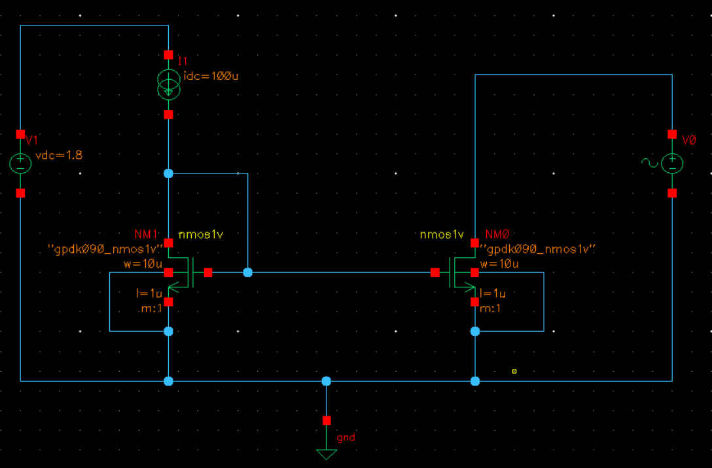
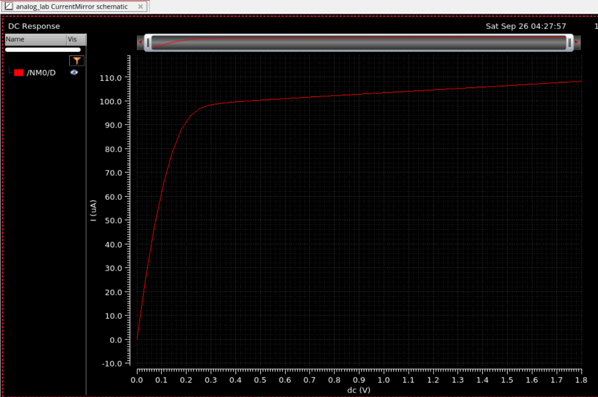
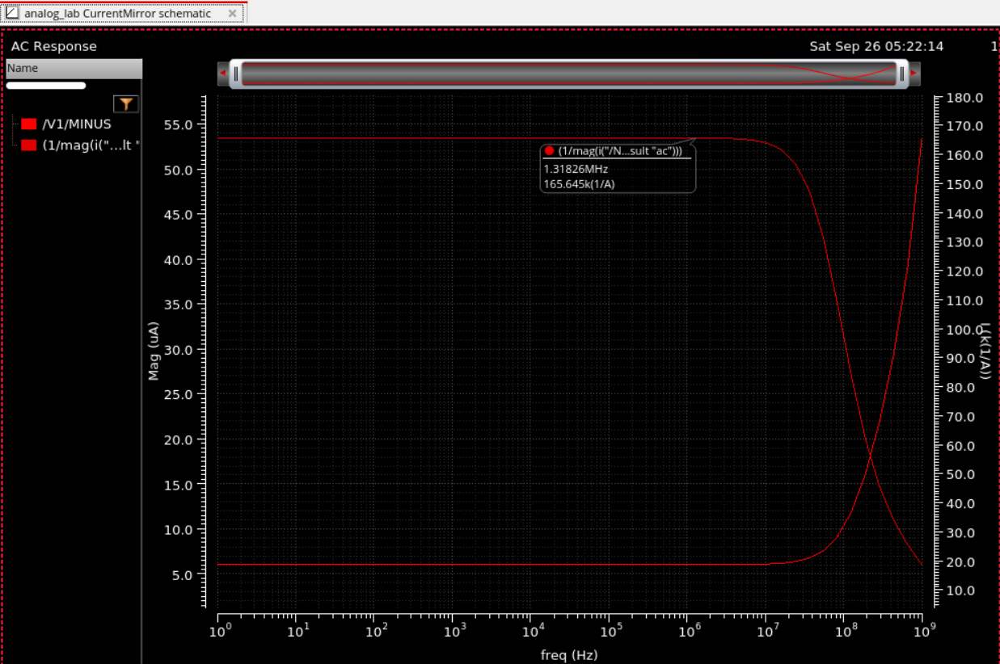

# Experiment 3: Current Mirror

## Aim

To design a simple two-transistor NMOS current mirror in GPDK090 technology and study its DC transfer characteristics and small-signal AC output resistance.

## Design Specifications

| Parameter | Value |
|---|---|
| Technology | GPDK090 (90 nm CMOS) |
| Device | `nmos1v` (gpdk090_nmos1v) |
| Reference current, I_ref | 100 µA |
| Supply voltage, VDD | 1.8 V |
| W (NM0, NM1) | 10 µm |
| L (NM0, NM1) | 1 µm |
| Multiplier (m) | 1 |

## Circuit Description

The circuit consists of two identical NMOS transistors, NM1 and NM0. NM1 is diode-connected (gate shorted to drain) and biased by an ideal current source I1 = 100 µA from VDD = 1.8 V (V1). Its gate is tied to the gate of NM0, forming the mirror. The source terminals of both devices are grounded. The drain of NM0 is connected to an independent source V0, which is swept for the DC analysis and used to inject a unit AC test signal for the AC analysis.

See the [current mirror schematic](./Schematic/schematic.png).

## Simulation Procedure

1. **DC Analysis** — Swept the DC value of V0 from 0 V to 1.8 V (Start-Stop, Automatic), with "Save DC Operating Point" enabled. Plotted the drain current of NM0 (`NM0/D`) to obtain the I-V characteristic of the output branch.
   - [DC analysis setup](./Simulation/dc_analysis_setup.png)
   - [ADE-L outputs setup and run](./Simulation/ADEL_dc.png)
2. **AC Analysis** — Swept frequency from 1 Hz to 1 GHz (Automatic). With V0 supplying a unit AC magnitude at the output node, the AC current through NM0's drain was recorded.
   - [AC analysis setup](./Simulation/ac_analysis_setup.png)
   - [ADE-L outputs setup and run](./Simulation/ADEL_ac.png)
3. **Output resistance extraction** — Used the ADE calculator to compute the output resistance as `Rout = 1/mag(i("/NM0/D" ?result "ac"))` and plotted it against frequency.
   - [Calculator expression](./Simulation/Resistance_plot.png)

## Results

### DC Sweep (ID vs V0)

See the [DC sweep plot](./Waveforms/DC_Sweep.png) — the output current rises steeply for V0 < 0.25 V and saturates close to I_ref = 100 µA once NM0 enters saturation. Beyond this point, the current increases gradually (~100 µA to ~108 µA) as V0 goes from 0.3 V to 1.8 V, due to channel length modulation.

### AC Sweep — Output Resistance vs Frequency

See the [AC sweep plot](./Waveforms/AC_sweep.png) — the output resistance stays flat at approximately **165.6 kΩ** from low frequency up to ~10 MHz, then rolls off at higher frequencies, with the two traces crossing near 200 MHz.

## Observations

- With equal W/L for NM0 and NM1, the mirror ratio is 1, and the output current closely tracks I_ref in the saturation region.
- The output resistance is finite (~165.6 kΩ) rather than ideal (infinite), consistent with ro = 1/(λ·ID).
- The slight upward slope of current with V0 in saturation confirms the effect of channel length modulation.
- The output resistance falls off at high frequency because parasitic capacitances at the drain node (Cgd, Cdb) provide a low-impedance AC path, degrading the mirror's current-source behavior at RF.

## Conclusion

A simple NMOS current mirror was designed and simulated in GPDK090 technology. The DC sweep confirmed correct current mirroring with the output current saturating close to I_ref = 100 µA, and the AC analysis quantified a finite output resistance of ~165.6 kΩ that degrades at high frequency due to parasitic capacitance.

## Files in this folder

- [`Schematic/`](./Schematic) — Current mirror schematic screenshot
- [`Simulation/`](./Simulation) — ADE-L analysis setup and run screenshots
  - [DC analysis setup](./Simulation/dc_analysis_setup.png), [ADE-L DC run](./Simulation/ADEL_dc.png)
  - [AC analysis setup](./Simulation/ac_analysis_setup.png), [ADE-L AC run](./Simulation/ADEL_ac.png)
  - [Output resistance calculator expression](./Simulation/Resistance_plot.png)
- [`Waveforms/`](./Waveforms) — Output plots
  - [DC sweep](./Waveforms/DC_Sweep.png) — ID vs V0
  - [AC sweep](./Waveforms/AC_sweep.png) — Output resistance and mirrored current vs frequency
- [Full lab report (PDF)](./current_mirror_report.pdf)
