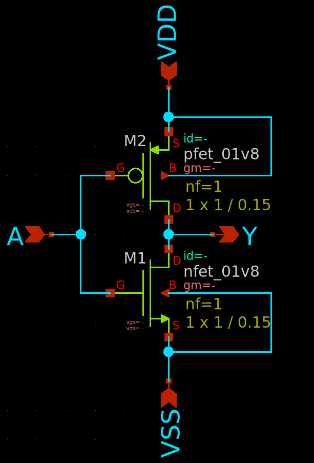
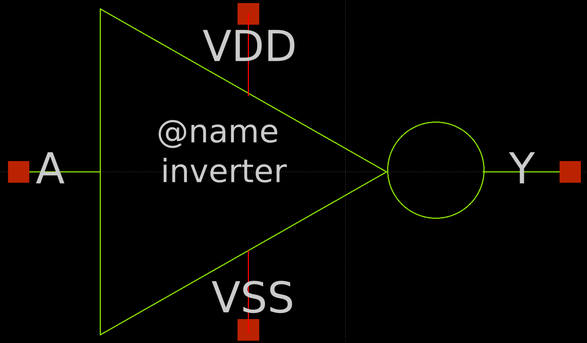
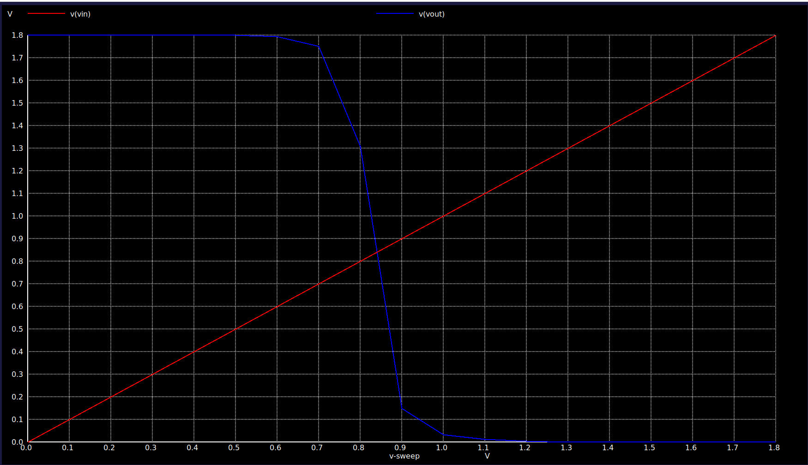
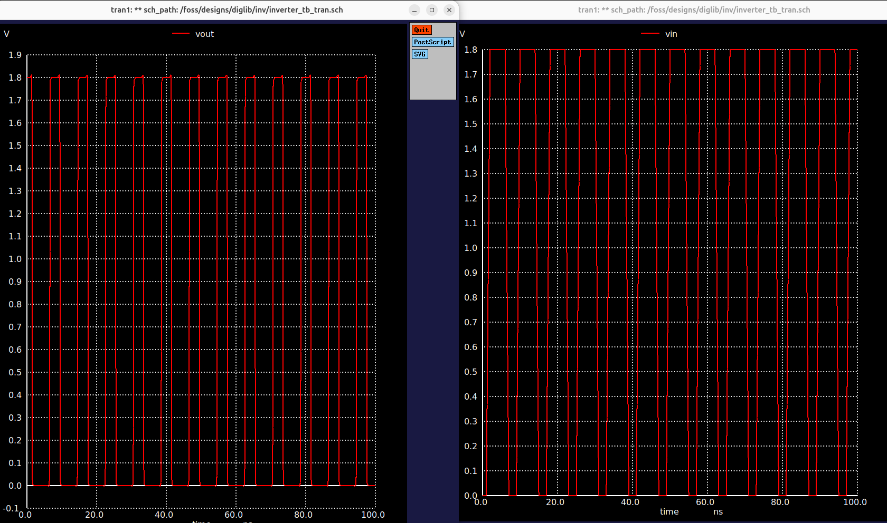
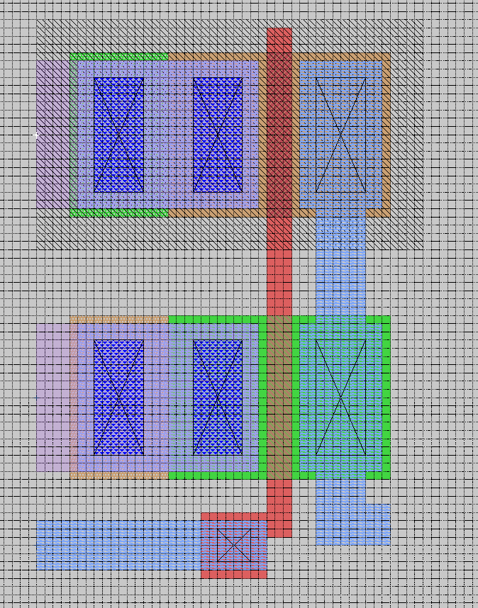
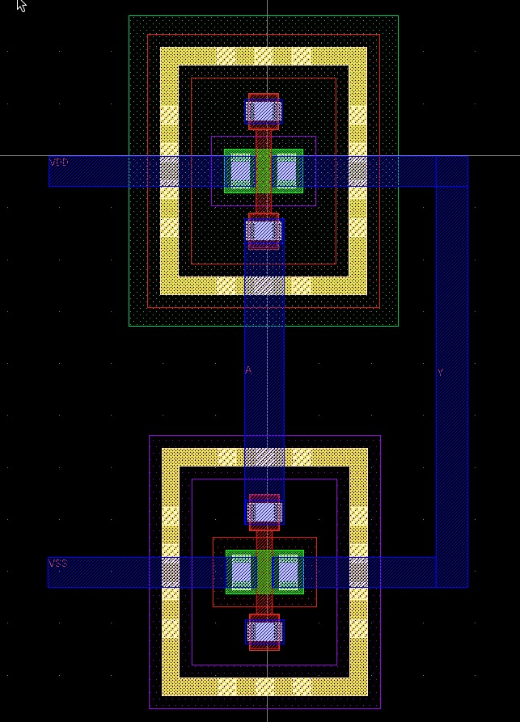
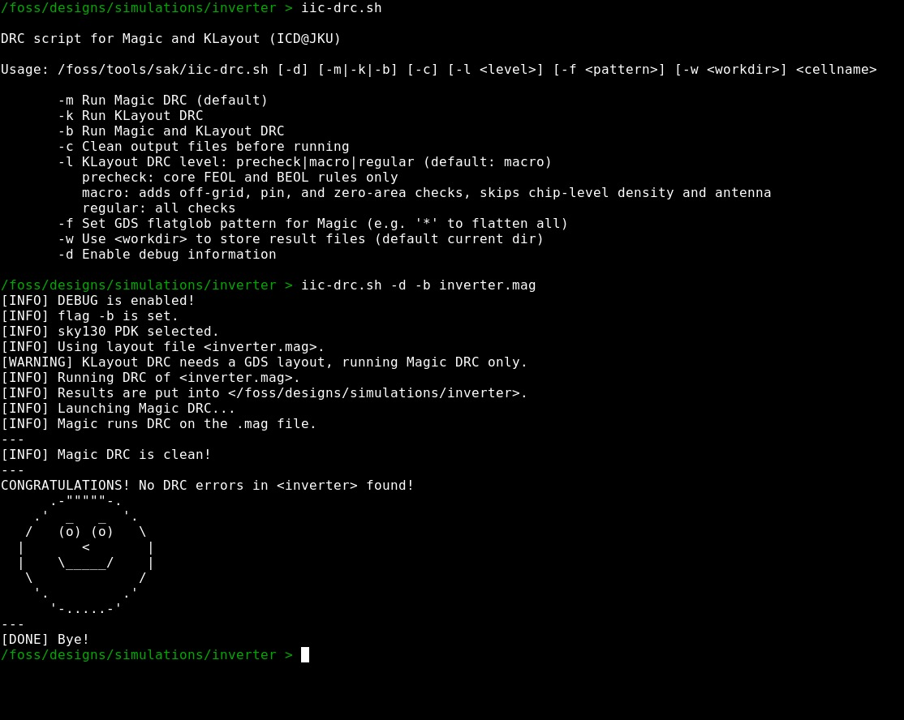
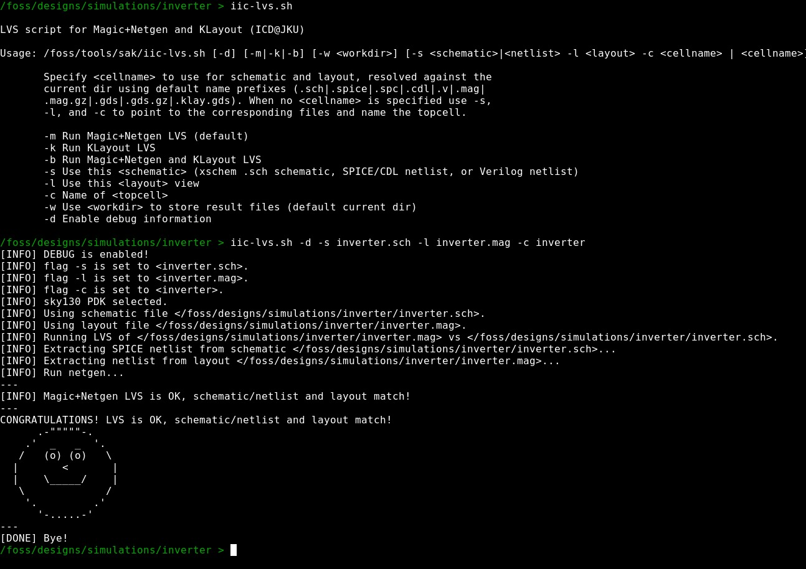

# Familiarisation of IIC-OSIC-TOOLS

**Name:** Deva Prassad S

## Aim

To get familiarised with the IIC-OSIC-Tools open-source EDA flow by taking a CMOS inverter through the complete design cycle — schematic capture, symbol creation, pre-layout (schematic) simulation, layout, physical verification (DRC/LVS), parasitic extraction, and post-layout simulation — using Xschem, ngspice, Magic VLSI, KLayout, and Netgen on the SKY130A PDK.

## Tools Used

| Tool | Purpose |
|---|---|
| **Xschem** | Schematic capture and symbol creation |
| **ngspice** | Circuit simulation (DC and transient) |
| **Magic VLSI** | Layout editing, DRC, and parasitic extraction (PEX) |
| **KLayout** | Layout viewing/verification (GDS) |
| **Netgen** | LVS (layout-vs-schematic) netlist comparison |
| **SKY130A PDK** | Open-source 130 nm process design kit (`sky130_fd_pr`) |

## Design Specifications

| Parameter | Value |
|---|---|
| Circuit | CMOS Inverter |
| PMOS device | `sky130_fd_pr__pfet_01v8` |
| NMOS device | `sky130_fd_pr__nfet_01v8` |
| W / L (both devices) | 1 / 0.15 (nf = 1) |
| Supply voltage (VDD) | 1.8 V |
| PDK | SKY130A |

## 1. Schematic Capture

The CMOS inverter schematic was drawn in Xschem with a `pfet_01v8` pull-up and `nfet_01v8` pull-down, gates tied together as input **A**, drains tied together as output **Y**, sources/bulk tied to `VDD`/`VSS`.

[`schematic/inverter.sch`](./schematic/inverter.sch) · [`schematic/schematic.png`](./schematic/schematic.png)

## 2. Symbol Creation

An inverter symbol (`A` in, `Y` out, `VDD`/`VSS` power pins) was generated from the schematic for reuse as a sub-circuit block in test benches.

[`Symbol/inverter.sym`](./Symbol/inverter.sym) · [`Symbol/symbol.png`](./Symbol/symbol.png)

## 3. Pre-Layout (Schematic) Simulation

### 3.1 DC Test Bench — Voltage Transfer Characteristic

`Vin` was swept from 0 to 1.8 V in 0.1 V steps with `VDD` = 1.8 V, using ngspice's `dc` analysis.

[`Test Bench/DC/inverter_tb.sch`](./Test%20Bench/DC/inverter_tb.sch) · [`Test Bench/DC/inverter_tb.spice`](./Test%20Bench/DC/inverter_tb.spice)

**Result:** [`Waveform/dc/waveform_dc.png`](./Waveform/dc/waveform_dc.png)

The output switches sharply from `VDD` to `0` as `Vin` crosses the switching threshold (≈ 0.85 V), confirming correct inverting behaviour.

### 3.2 Transient Test Bench

`Vin` was driven with a pulse source (0 → 1.8 V, rise/fall 1 ns, pulse width 4 ns, period 8 ns) for a 100 ns transient run (`.tran 0.01n 100n`).

[`Test Bench/Transient/inverter_tb_tran.sch`](./Test%20Bench/Transient/inverter_tb_tran.sch) · [`Test Bench/Transient/inverter_tb_tran.spice`](./Test%20Bench/Transient/inverter_tb_tran.spice)

**Result:** [`Waveform/transient/waveform_tran.png`](./Waveform/transient/waveform_tran.png)

`Vout` toggles as the complement of `Vin` on every pulse, confirming correct dynamic switching.

## 4. Layout

### 4.1 Magic Layout

The inverter layout was drawn in Magic VLSI on the SKY130A grid.

[`Layout/magic/inverter.mag`](./Layout/magic/inverter.mag)

### 4.2 KLayout View

The GDS export was cross-checked in KLayout.

[`Layout/klayout/inverter.gds`](./Layout/klayout/inverter.gds)

## 5. Design Rule Check (DRC)

DRC was run in Magic via `iic-drc.sh -d -b inverter.mag`.

[`DRC/inverter.magic.drc.rpt`](./DRC/inverter.magic.drc.rpt) · [`DRC/sky130_drc.txt`](./DRC/sky130_drc.txt)

## 6. Layout-vs-Schematic (LVS)

LVS was run with Magic + Netgen via `iic-lvs.sh -d -s inverter.sch -l inverter.mag -c inverter`.

[`LVS/inverter.lvs.out`](./LVS/inverter.lvs.out) · [`LVS/inverter.lvs.log`](./LVS/inverter.lvs.log)

## 7. Parasitic Extraction (PEX)

Full-RC parasitic extraction was run in Magic via `iic-pex.sh -d -m 3 inverter.mag`, producing an extracted SPICE netlist with parasitic resistances and capacitances back-annotated.

[`Extracted View/inverter.pex.spice`](./Extracted%20View/inverter.pex.spice) · [`Extracted View/inverter.pex.log`](./Extracted%20View/inverter.pex.log)

## 8. Post-Layout Simulation

The extracted netlist (`inverter.pex.spice`) was included in the same DC and transient test benches to verify functionality with layout parasitics included.

### 8.1 Post-Layout DC

### 8.2 Post-Layout Transient

The post-layout waveforms closely track the pre-layout (schematic-level) results, with the expected small additional delay/rounding introduced by layout parasitics.

## Observations

- The schematic-level and post-layout (parasitic-extracted) DC and transient responses match closely, with only minor timing degradation after PEX.
- DRC reported **zero errors**, confirming the layout is manufacturable under SKY130A design rules.
- LVS confirmed a **unique match** between schematic and layout netlists (2 devices, 4 nets).
- This exercise validated the complete open-source RTL-to-GDS-style analog flow (Xschem → ngspice → Magic → KLayout → Netgen) available inside the IIC-OSIC-Tools container.

## Conclusion

A CMOS inverter was successfully taken through the full IIC-OSIC-Tools open-source design flow — schematic capture, symbol generation, pre-layout simulation, layout, DRC, LVS, parasitic extraction, and post-layout simulation — with all verification steps (DRC, LVS) passing cleanly, confirming familiarity with the open-source SKY130 analog design flow.

## Files in this folder

- [`schematic/`](./schematic) — Inverter schematic (`.sch`) and screenshot
- [`Symbol/`](./Symbol) — Inverter symbol (`.sym`) and screenshot
- [`Test Bench/DC/`](./Test%20Bench/DC), [`Test Bench/Transient/`](./Test%20Bench/Transient) — ngspice DC and transient test benches
- [`Waveform/dc/`](./Waveform/dc), [`Waveform/transient/`](./Waveform/transient) — Pre-layout simulation results
- [`Layout/magic/`](./Layout/magic), [`Layout/klayout/`](./Layout/klayout) — Magic layout and KLayout GDS view
- [`DRC/`](./DRC) — DRC script run and report
- [`LVS/`](./LVS) — LVS script run, log, and output
- [`Extracted View/`](./Extracted%20View) — PEX run and extracted SPICE netlist
- [`post layout simulation/dc/`](./post%20layout%20simulation/dc), [`post layout simulation/transient/`](./post%20layout%20simulation/transient) — Post-layout simulation results
- [`report/Familiarisation_of_IIC-OSIC-TOOLS_Report.pdf`](./report/Familiarisation_of_IIC-OSIC-TOOLS_Report.pdf) — report
